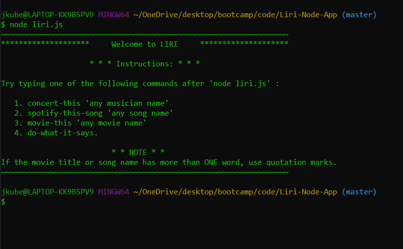

# Liri-Node-App  📱

## About LIRI 📖

LIRI is like iPhone's SIRI. However, while SIRI is a Speech Interpretation and Recognition Interface, LIRI is a Language Interpretation and Recognition Interface. Liri is a command line node-app that takes in specific parameters and gives the user back data.


## How to Use 🤔

The user has four options, or commands, to choose from. The command chosen, combined with a specific "parameter", or input, set by the user will return a table of logged data.

The `commands` are:

* `spotify-this-song`
* `concert-this`
* `movie-this`
* `do-what-it-says`



**Remember**

If the band/artist or movie name you enter has more than one word, you must use quotations.

## How it Works 🔨

### 🎧 spotify-this-song


The `spotify-this-song` command searches the `Node-Spotify-API` by sending user input as a parameter for the call to retrieve relevant song information.

``` 
spotify.search({ type: 'track', query: input }, function (err, data) {
    if (err) {
        // Log error
        console.log(
            "~~~~~~~~~~~~~~~~~~~~~~~~~~~~~~~~~~~~~~~~~~~~~~~~~~~~~~~~~~~~~~~~~" + "\r\n" +             
            "          Oops... LIRI cannot find any data         >.<" + "\r\n" +
            "~~~~~~~~~~~~~~~~~~~~~~~~~~~~~~~~~~~~~~~~~~~~~~~~~~~~~~~~~~~~~~~~~" + "\r\n" +          
            'Error occurred: ' + err
        );
        return;
    } else if (!err) {
        // Store data object
        let songData = data.tracks.items
        let song = songData[0];
        // Log song data for user
        console.log(
            "~~~~~~~~~~~~~~~~~~~~~~~~~~~~~~~~~~~~~~~~~~~~~~~~~~~~~~~~~~~~~~~~~" + "\r\n" +                 
            "\r\n" + "       LIRI Spotify response for " + input + "!" + "\r\n" + "\r\n" +              
            "_________________________________________________________________"
        );
            // Iterate through artist array if multiple artists
            for(var i = 0; i < song.artists.length; i++) {
                console.log("Artist:       " + song.artists[i].name);
            }
        console.log(
            "_________________________________________________________________" + "\r\n" + 
            "Song:         " + song.name + "\r\n" + 
            "_________________________________________________________________" + "\r\n" + 
            "Album:        " + song.album.name + "\r\n" + 
            "_________________________________________________________________" + "\r\n" + 
            "Preview:      " + song.preview_url + "\r\n" + 
            "_________________________________________________________________" + "\r\n" + "\r\n" +
            "~~~~~~~~~~~~~~~~~~~~~~~~~~~~~~~~~~~~~~~~~~~~~~~~~~~~~~~~~~~~~~~~~"
        );
    }
});
```

#### Examples

* `spotify-this-song "Bohemian Rhapsody"`
* `spotify-this-song "Never Gonna Give You Up"`
* `spotify-this-song "2009 Mac Miller"`

The *Spotify API* requires you sign up as a developer to generate the necessary credentials. You can either login to your existing Spotify account or create a new one (a free account is fine) and log in. From there you will be able to generate a **client id** and **client secret**.

### 🎸 concert-this


The `concert-this` command searches the `Bands in Town API` by sending user input as a parameter in the `Axios` call to retrieve relevant concert information.

```
let queryURL = "https://rest.bandsintown.com/artists/" + input + "/events?app_id=codingbootcamp";
axios.get(queryURL)
.then(function (response) {
    // Store data object
    let concertData = response.data;
    // Iterate through response to parse each concert
    for(var i = 0; i < concertData.length; i++) {
        // Prettify date using Moment
        let formatDate = moment(concertData[i].datetime).format("MM-DD-YYYY");
        // Log concert info
        console.log(
            "~~~~~~~~~~~~~~~~~~~~~~~~~~~~~~~~~~~~~~~~~~~~~~~~~~~~~~~~~~~~~~~~~" + "\r\n" + "\r\n" +                           
            "         LIRI Bands in Town response for " + input + "!" + "\r\n" + "\r\n" + 
            "_________________________________________________________________" + "\r\n" + 
            "Venue:            " + concertData[i].venue.name + "\r\n" +
            "_________________________________________________________________" + "\r\n" +
            "Location:         " + concertData[i].venue.city + ", " + concertData[i].venue.country + "\r\n" +
            "_________________________________________________________________" + "\r\n" +
            "Date:             " + formatDate + "\r\n" +
            "_________________________________________________________________" + "\r\n" + "\r\n" +
            "~~~~~~~~~~~~~~~~~~~~~~~~~~~~~~~~~~~~~~~~~~~~~~~~~~~~~~~~~~~~~~~~~"
        );
    }            
})
```

#### Examples

* `concert-this "Wu Tang Clan"`
* `concert-this "Bassnectar"`
* `concert-this "Chris Webby"`

The *Bands in Town API* response sends back the date in a poor UX format. `Moment.js` was used to **format** the date in a more user friendly manner. (MM/DD/YYY)

### 📺 movie-this


The `movie-this` command searches the `OMDB API` by sending user input as a parameter in the `Axios` call to retrieve relevant movie information.

```
var queryUrl = "http://www.omdbapi.com/?t=" + input + "&y=&plot=short&apikey=" + omdb;
axios.get(queryUrl)
.then(function (response) {

    // Store data object
    let movieData = response.data;

    // Log Movie info
    console.log(
        "~~~~~~~~~~~~~~~~~~~~~~~~~~~~~~~~~~~~~~~~~~~~~~~~~~~~~~~~~~~~~~~~~" + "\r\n" + "\r\n" + 
        "              LIRI OMDB response for " + input + "!" + "\r\n" + "\r\n" + 
        "_________________________________________________________________" + "\r\n" + 
        "Title:                   " + movieData.Title + "\r\n" + 
        "_________________________________________________________________" + "\r\n" + 
        "Cast: " + movieData.Actors + "\r\n" + 
        "_________________________________________________________________" + "\r\n" + 
        "Year Released:           " + movieData.Year + "\r\n" + 
        "_________________________________________________________________" + "\r\n" + 
        "IMDB Rating:             " + movieData.imdbRating + "\r\n" + 
        "_________________________________________________________________" + "\r\n" + 
        "Rotten Tomatoes Score:   " + movieData.Ratings[1].Value + "\r\n" + 
        "_________________________________________________________________"  + "\r\n" + 
        "Country Produced:        " + movieData.Country + "\r\n" + 
        "_________________________________________________________________" + "\r\n" + 
        "Language:                " + movieData.Language + "\r\n" + 
        "_________________________________________________________________" + "\r\n" +     
        "Plot: " + movieData.Plot + "\r\n" + 
        "_________________________________________________________________" + "\r\n" + "\r\n" +
        "~~~~~~~~~~~~~~~~~~~~~~~~~~~~~~~~~~~~~~~~~~~~~~~~~~~~~~~~~~~~~~~~~"
    );                
})
```

#### Examples

* `movie-this "The Beach"`
* `movie-this "Guardians of the Galaxy"`
* `movie-this "The Matrix"`

The `OMDB API` requires you to provide a unique **API Key** to retrieve a data response. You can do this by signing up for a developer account to recieve a *personal* key or you may use `trilogy`.

### 📓 do-what-it-says


The `do-what-is-says` commands reads through the random.txt file and uses that text to perform another one of LIRI's commands.

```
fs.readFile("random.txt", "utf8", function(error, data) {
    if (error) {
        return console.log(error);
    }

    // Split random.txt array and store each index as variables
    let randomArr = data.split(",")
    let action = randomArr[0];
    let input = randomArr[1];
    
    // Decides which function to call dependent on random.txt
    switch (action) {
        case "spotify-this-song":
            spotifySong(input);
            break;
        case "concert-this":
            concertThis(input);
            break;
        case "movie-this":
            movieThis(input);
            break;
        default: "";
    }
});
```

The `fs Node Package` is used to read the text inside the random.txt file.

## Pre-Requisites

To retrieve the data that will power this app, you'll need to send requests using NPM packages. Downloading the following Node packages is crucial for this applications functionality.

* Node-Spotify-API `npm install node-spotify-api`
* Axios `npm install axios`
* Moment `npm install moment`
* DotEnv `npm install dotenv`

## Getting Started 🏁

The following steps will get you a copy of the application up and running on your local machine for testing and grading puproses.

1. Clone this repository from github.
2. Git clone repository in IDE of choice
3. Open folder in text-editor of choice
4. Create a `.env` file (Personal credentials will live here)
5. In `.env` place these lines:
`SPOTIFY_ID=<YOUR SPOTIFY ID HERE>`
`SPOTIFY_SECRET=<YOUR SPOTIFY SECRET HERE>`
`OMDB_API=<YOUR OMDB API KEY HERE>`
6. If all pre-requisites are met, open application in IDE and run by typing `node liri.js`!

## Technologies Used 💻

* Axios
* Git
* Javascript ES5
* JSON
* Node.js
* NPM
* Moment.js
* VS Code

## Creator ✋

**Joey Kubalak**
AKA 
👇
*Treez*

Github profile 👉 [TreezCode](https://github.com/TreezCode)