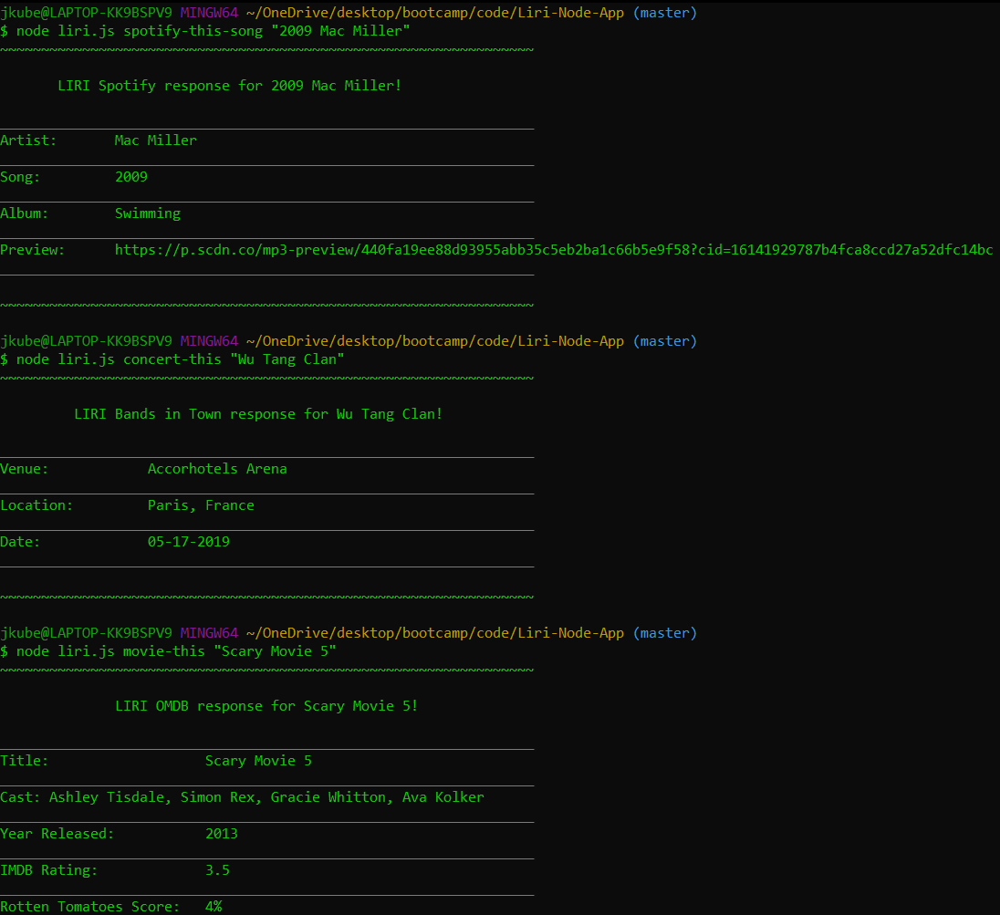

# Liri-Node-App  📱

## About LIRI 📖

LIRI is like iPhone's SIRI. However, while SIRI is a Speech Interpretation and Recognition Interface, LIRI is a Language Interpretation and Recognition Interface. Liri is a command line node-app that takes in specific parameters and gives the user back data.



## How to Use 🤔

The user has four options, or commands, to choose from. The command chosen, combined with a specific "parameter" set by the user, will return a table of logged data.

The `commands` are:

* `spotify-this-song`
* `concert-this`
* `movie-this`
* `do-what-it-says`


**Remember**

If the band/artist or movie name you enter has more than one word, you must use quotations.

## How it Works 🔨

### spotify-this-song 🎧

The `spotify-this-song` command searches the `Node-Spotify-API` by sending user input as a parameter for the call to retrieve relevant song information.

``` 
spotify.search({ type: 'track', query: input }, function (err, data) {
    if (err) {
        // Log error
        console.log(
            "~~~~~~~~~~~~~~~~~~~~~~~~~~~~~~~~~~~~~~~~~~~~~~~~~~~~~~~~~~~~~~~~~" + "\r\n" +             
            "          Oops... LIRI cannot find any data         >.<" + "\r\n" +
            "~~~~~~~~~~~~~~~~~~~~~~~~~~~~~~~~~~~~~~~~~~~~~~~~~~~~~~~~~~~~~~~~~" + "\r\n" +          
            'Error occurred: ' + err
        );
        return;
    } else if (!err) {
        // Store data object
        let songData = data.tracks.items
        let song = songData[0];
        // Log song data for user
        console.log(
            "~~~~~~~~~~~~~~~~~~~~~~~~~~~~~~~~~~~~~~~~~~~~~~~~~~~~~~~~~~~~~~~~~" + "\r\n" +                 
            "\r\n" + "       LIRI Spotify response for " + input + "!" + "\r\n" + "\r\n" +              
            "_________________________________________________________________"
        );
            // Iterate through artist array if multiple artists
            for(var i = 0; i < song.artists.length; i++) {
                console.log("Artist:       " + song.artists[i].name);
            }
        console.log(
            "_________________________________________________________________" + "\r\n" + 
            "Song:         " + song.name + "\r\n" + 
            "_________________________________________________________________" + "\r\n" + 
            "Album:        " + song.album.name + "\r\n" + 
            "_________________________________________________________________" + "\r\n" + 
            "Preview:      " + song.preview_url + "\r\n" + 
            "_________________________________________________________________" + "\r\n" + "\r\n" +
            "~~~~~~~~~~~~~~~~~~~~~~~~~~~~~~~~~~~~~~~~~~~~~~~~~~~~~~~~~~~~~~~~~"
        );
    }
});
```

#### Examples

* `spotify-this-song "Bohemian Rhapsody"`
* `spotify-this-song "Never Gonna Give You Up"`
* `spotify-this-song "2009 Mac Miller"`

The *Spotify API* requires you sign up as a developer to generate the necessary credentials. You can either login to your existing Spotify account or create a new one (a free account is fine) and log in. From there you will be able to generate a **client id** and **client secret**.

### concert-this 🎸
The `concert-this` command searches the `Bands in Town API` by sending user input as a parameter in the `Axios` call to retrieve relevant concert information.

```
axios.get(queryURL)
.then(function (response) {
    // Store data object
    let concertData = response.data[0];
    // Prettify date using Moment
    let formatDate = moment(concertData.datetime).format("MM-DD-YYYY");
    // Log concert info
    console.log(
        "~~~~~~~~~~~~~~~~~~~~~~~~~~~~~~~~~~~~~~~~~~~~~~~~~~~~~~~~~~~~~~~~~" + "\r\n" + "\r\n" +                           
        "         LIRI Bands in Town response for " + input + "!" + "\r\n" + "\r\n" + 
        "_________________________________________________________________" + "\r\n" + 
        "Venue:            " + concertData.venue.name + "\r\n" +
        "_________________________________________________________________" + "\r\n" +
        "Location:         " + concertData.venue.city + ", " + concertData.venue.country + "\r\n" +
        "_________________________________________________________________" + "\r\n" +
        "Date:             " + formatDate + "\r\n" +
        "_________________________________________________________________" + "\r\n" + "\r\n" +
        "~~~~~~~~~~~~~~~~~~~~~~~~~~~~~~~~~~~~~~~~~~~~~~~~~~~~~~~~~~~~~~~~~"
    );            
})
```

#### Examples

* `concert-this "Wu Tang Clan"`
* `concert-this "Bassnectar"`
* `concert-this "Chris Webby"`

The *Bands in Town API* response sends back the date in a poor UX format. `Moment.js` was used to **format** the date in a more user friendly manner. (MM/DD/YYY)

### movie-this 📺

The `movie-this` command searches the `OMDB API` by sending user input as a parameter in the `Axios` call to retrieve relevant movie information.

```
var queryUrl = "http://www.omdbapi.com/?t=" + input + "&y=&plot=short&apikey=" + omdb;
axios.get(queryUrl)
.then(function (response) {

    // Store data object
    let movieData = response.data;

    // Log Movie info
    console.log(
        "~~~~~~~~~~~~~~~~~~~~~~~~~~~~~~~~~~~~~~~~~~~~~~~~~~~~~~~~~~~~~~~~~" + "\r\n" + "\r\n" + 
        "              LIRI OMDB response for " + input + "!" + "\r\n" + "\r\n" + 
        "_________________________________________________________________" + "\r\n" + 
        "Title:                   " + movieData.Title + "\r\n" + 
        "_________________________________________________________________" + "\r\n" + 
        "Cast: " + movieData.Actors + "\r\n" + 
        "_________________________________________________________________" + "\r\n" + 
        "Year Released:           " + movieData.Year + "\r\n" + 
        "_________________________________________________________________" + "\r\n" + 
        "IMDB Rating:             " + movieData.imdbRating + "\r\n" + 
        "_________________________________________________________________" + "\r\n" + 
        "Rotten Tomatoes Score:   " + movieData.Ratings[1].Value + "\r\n" + 
        "_________________________________________________________________"  + "\r\n" + 
        "Country Produced:        " + movieData.Country + "\r\n" + 
        "_________________________________________________________________" + "\r\n" + 
        "Language:                " + movieData.Language + "\r\n" + 
        "_________________________________________________________________" + "\r\n" +     
        "Plot: " + movieData.Plot + "\r\n" + 
        "_________________________________________________________________" + "\r\n" + "\r\n" +
        "~~~~~~~~~~~~~~~~~~~~~~~~~~~~~~~~~~~~~~~~~~~~~~~~~~~~~~~~~~~~~~~~~"
    );                
})
```

#### Examples

* `movie-this "The Beach"`
* `movie-this "Guardians of the Galaxy"`
* `movie-this "The Matrix"`

The `OMDB API` requires you to provide a unique **API Key** to retrieve a data response. You can do this by signing up for a developer account to recieve a *personal* key or you may use `trilogy`.